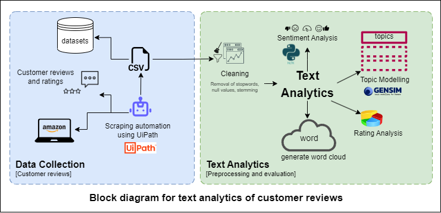
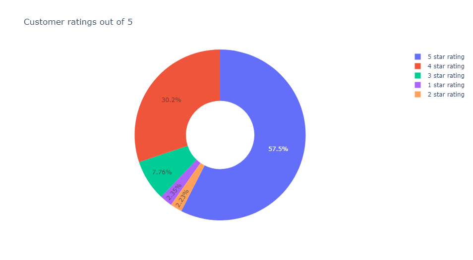
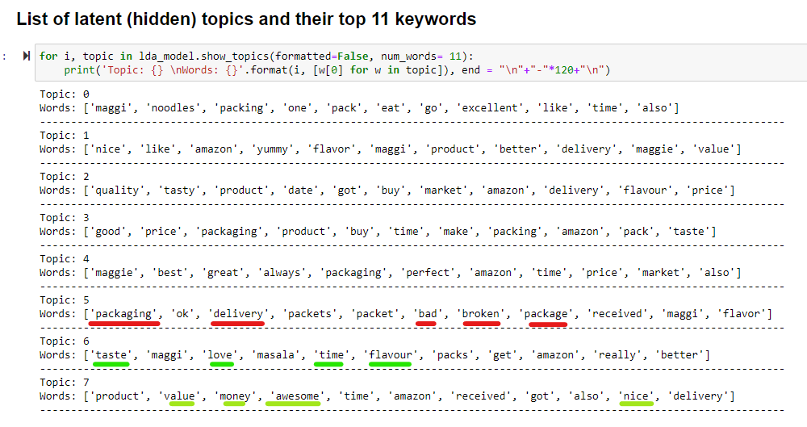
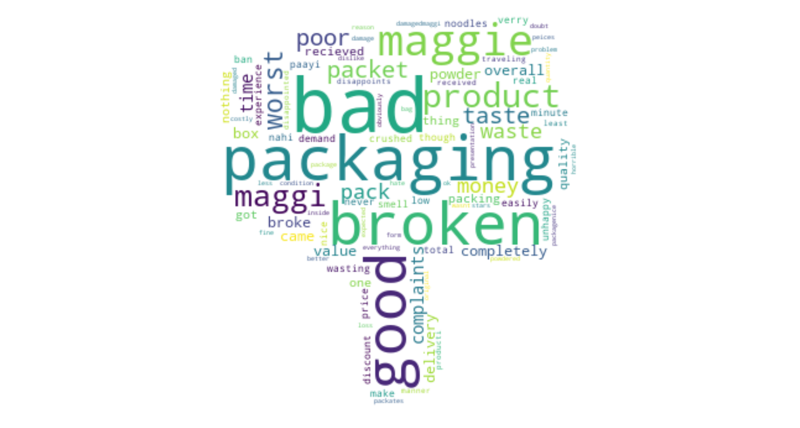
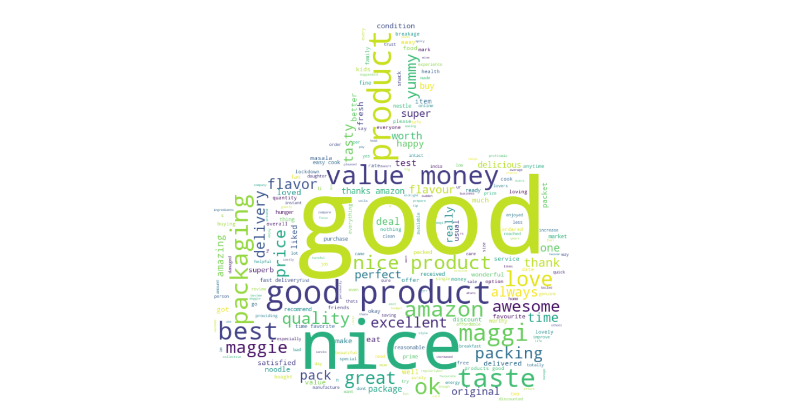

# Sentiment Analysis, Word Cloud and Topic Modelling on customer reviews of FMCG products

                            


# Project Overview

>The problem addressed by this project is to analyze customer sentiments and feedback regarding Fast Moving Consumer Goods (FMCG) products. The availability of a vast amount of customer reviews on e-commerce platforms like Amazon presents an opportunity to gain insights into customer perceptions, preferences, and satisfaction levels. The goal is to extract valuable insights from a large volume of text data to understand customer perceptions, identify key themes, and make data-driven decisions for product development and marketing strategies.
---

# Methodology
- __Identifying the top products of each company:__ In the first step, we will identify the top products sold by each company based on their sales figures, customer ratings, and customer reviews.

- __Scrape the reviews of the identified products*:__ Once we have identified the top products of each company, we will scrape the reviews of these products from the e-commerce websites. We will use Ui path/ Puppeteer libraries to extract the data from the websites.
*Our web scraping process is not causing any DOS, and the scraped data is solely for educational purposes.

- __Perform Text Analysis:__ Performing Sentiment Analysis, Word Cloud and Topic Modelling on the reviews of the top products of each company.

- __Analyze the Results:__ Analyzing the results of the text analysis to understand the customer sentiment towards the top products of each company and derive insights from the results. 
  
  


# Advantages
- __Better Understanding of Customer Sentiment:__ Sentiment analysis allows businesses to get a better understanding of their customers' sentiment towards their product or service. By analyzing the language used in customer reviews, sentiment analysis can provide insight into the positive or negative sentiments expressed by customers.
  
- __Improved Customer Service:__ Sentiment analysis can help businesses identify customer issues or complaints in real-time, allowing them to address concerns quickly and effectively. This can lead to improved customer  atisfaction and loyalty.

- __Competitive Analysis:__ By analyzing the sentiment of customer reviews, businesses can gain insights into how their products or services compare to those of their competitors. This can help businesses make informed decisions about product development, marketing strategies, and pricing.

- __Marketing Insights:__ By analyzing customer sentiment, businesses can gain insights into what their customers like and dislike about their products or services. This information can be used to create more targeted marketing campaigns that resonate with their target audience.

# Installation and Setup
Open the terminal and navigate to the desired directory where you want to clone the repository:
```
git clone https://github.com/krishnavpai/Sentiment-Analysis-Word-Cloud-and-Topic-Modelling-on-customer-reviews-of-FMCG-products-in-India.git
```
Install Jupyter Notebook: If you don't have Jupyter Notebook installed:
```
pip install jupyter
```
Set up a virtual environment (optional): It is recommended to create a virtual environment to isolate the project's dependencies:
``` 
cd <repository_directory>
python -m venv env
```
Activate/Deactivate the virtual environment For Windows:
```
.\env\Scripts\activate
```
For macOS and Linux:
```
source env/bin/activate
```
If you want to deactivate the virtual environment, simply run:
```
.\env\Scripts\decactivate
```

Install project dependencies:
```
pip install -r requirements.txt
```
Launch Jupyter Notebook:
```
jupyter notebook
```


# Acknowledgments/References
 The following are the references used for this project:
1. [Sentiment Analysis using NLTK](https://medium.com/towards-data-science/basic-binary-sentiment-analysis-using-nltk-c94ba17ae386)
2. [Word Cloud in Python](https://www.datacamp.com/community/tutorials/wordcloud-python)
3. [Topic Modeling with Gensim](https://www.machinelearningplus.com/nlp/topic-modeling-gensim-python/)
4. [Topic Modeling with LDA](https://towardsdatascience.com/topic-modeling-with-latent-dirichlet-allocation-by-example-3b22cd10c835)
5. [UiPath](https://www.uipath.com/)


# License
For this github repository, the License used is [MIT License](https://opensource.org/license/mit/).
